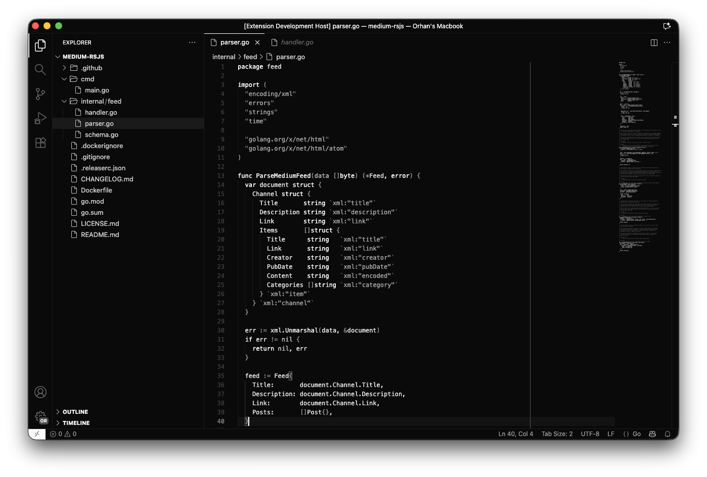

# nue

Nue is designed for developers who value clarity and simplicity. With a carefully crafted monochrome palette, it reduces visual noise while maintaining excellent readability for long coding sessions.

  

## Installation

1. Open VS Code
2. Go to Extensions (⌘+Shift+X / Ctrl+Shift+X)
3. Search for "Nue"
4. Click Install
5. Open Command Palette (⌘+Shift+P / Ctrl+Shift+P)
6. Select "Preferences: Color Theme"
7. Choose "Nue"

## Feedback

Found an issue or have a suggestion? [Open an issue](https://github.com/orhantugrul/nue/issues)